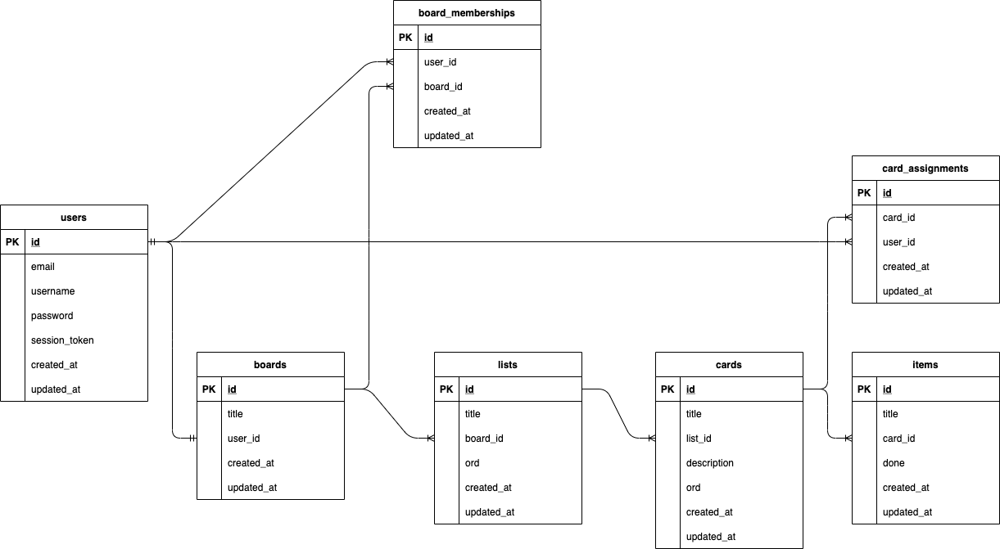

**TaskManagement-APP**

**TODO** 

- Genel klasor yapisi duzenlecek ve isimlendirmeler,
- Ara katmanlar eklenecek,
- Kullanici modeli bitirilecek,
- pano kismi genel oalrak yapildi duzenlenecek

**TEST** 

- Auth Kayit endpointleri,
- jwt ara katmaninda duzenlendi

**COMPLETE** 

- 

 Postman docs

 db diagram

